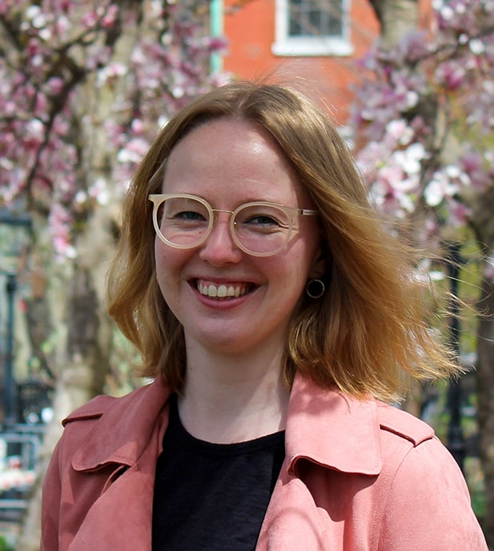
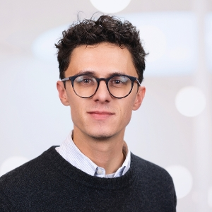

# Instructors

[Felicia Loecherbach](https://felicialoecherbach.com) is an Assistant Professor
of Political Communication and Journalism at the Amsterdam School of
Communication Research. Prior to this, she has been a postdoctoral fellow at the
Center of Social Media and Politics (CSMaP) at the NYU and a PhD student in
Computational Political Communication Science at the Vrije Universiteit
Amsterdam. Her research interests include (the diversity of) online news
consumption and using computational methods in the social sciences.
Specifically, she uses computational approaches to study when and where users
come across different types of news – collecting digital trace data via
innovative approaches such as data donations, analyzing different dimensions of
diversity of the content and how it affects perceptions and attitudes of users.
Apart from this, she has been involved in studying the challenges of different
modes of news access, for example via news recommender systems, private
messaging, and smart assistants.

[Hannes Cools](https://www.uva.nl/en/profile/c/o/h.cools/h.cools.html) is a
postdoctoral researcher at the AI, Media, and Democracy Lab at the University of
Amsterdam, The Netherlands. He is also a postdoctoral researcher at the Digital
Democracy Centre (DDC) at the University of Southern Denmark. His research
interests include (generative) AI, computational journalism, algorithmic
recommender systems and newsroom innovation. He is also an affiliated researcher
at the Brown Institute of the Columbia Journalism School in New York City. From
2018 till 2022, he was a PhD-candidate at the Institute for Media Studies (IMS),
University of Leuven (KU Leuven), Belgium where he studied AI in journalism.
Before, he worked as a journalist at De Morgen (DPG Media) in Belgium where he
covered technology and international politics.Journalism, Media & Globalization.
